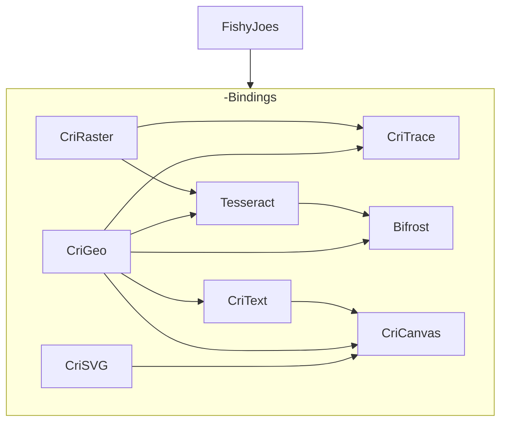

```mermaid
graph TD;
FishyJoes --> -Bindings;
subgraph -Bindings
CriGeo --> CriText;
CriGeo & CriRaster ---> CriTrace;
CriGeo & CriRaster  --> Tesseract;
CriGeo & Tesseract --> Bifrost;
CriSVG ---> CriCanvas;
CriGeo & CriText --> CriCanvas;
end
```
