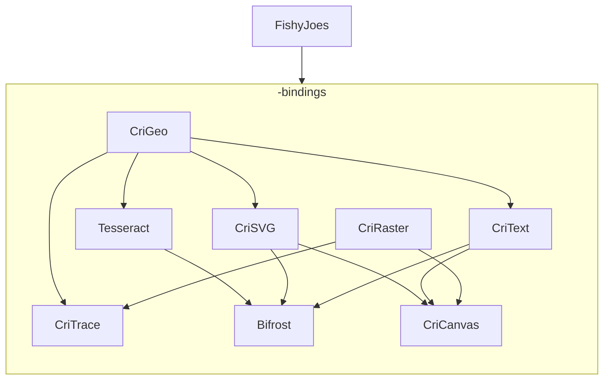

```mermaid
graph TB;
FishyJoes --> -bindings;
subgraph -bindings;
direction TB;
CriGeo --> CriText;
CriGeo --> CriSVG;
CriGeo & CriRaster --> CriTrace;
CriGeo  --> Tesseract;
Tesseract & CriSVG & CriText --> Bifrost;
CriSVG --> CriCanvas;
CriText & CriRaster --> CriCanvas;
end
```
