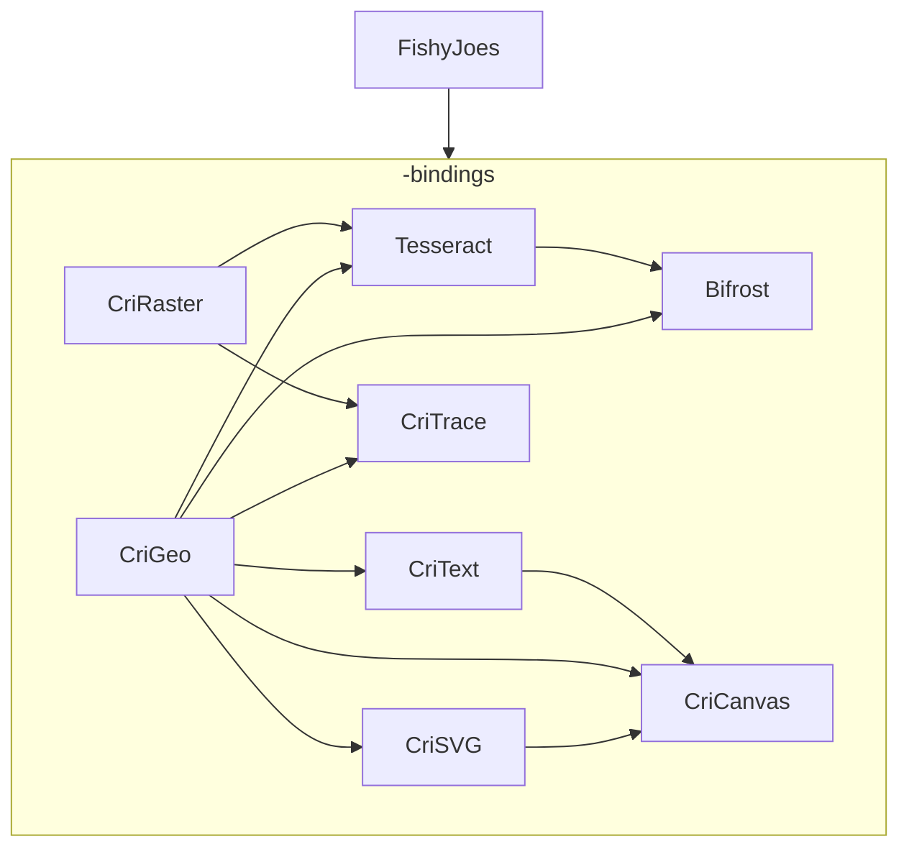

```mermaid
graph TD;
FishyJoes --> -bindings;
subgraph -bindings
CriGeo --> CriText;
CriGeo --> CriSVG;
CriGeo & CriRaster --> CriTrace;
CriGeo & CriRaster  --> Tesseract;
CriGeo & Tesseract --> Bifrost;
CriSVG --> CriCanvas;
CriGeo & CriText --> CriCanvas;
end
```
